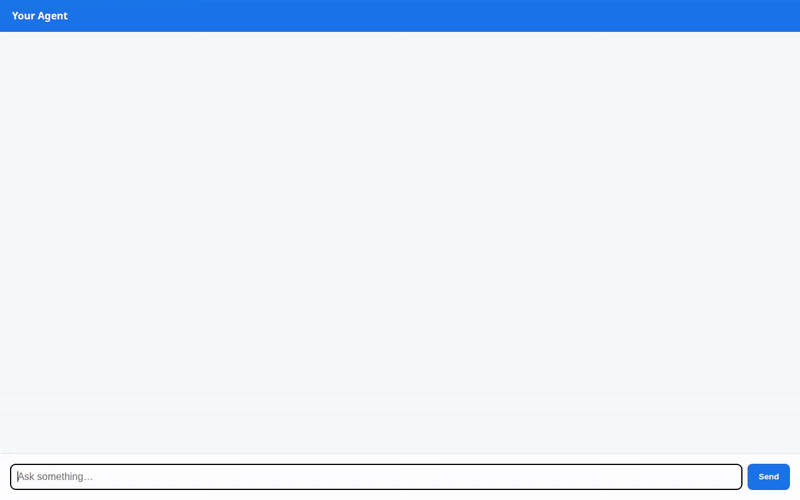

# 📈 SwingScout — AI Swing Trading & Momentum Assistant

> A conversational trading assistant that helps swing traders identify momentum breakout setups, compare peer tickers, and manage risk using technical indicators, quantitative sizing, and multimodal visual analysis.

<div align="center">



[](https://antigravity.google)
[](https://google.github.io/adk-docs/)
[](https://cloud.google.com/vertex-ai)
[](https://adk.dev/integrations/a2ui/)
[](LICENSE)

</div>

---

## 📖 Overview

**SwingScout** is an intelligent swing trading assistant built with Google's **Agent Development Kit (ADK)** and deployed to **Google Cloud Vertex AI Agent Runtime**. 

Engineered specifically for active swing traders operating across multi-day to multi-week time horizons, SwingScout combines objective technical indicators (RSI, 20/50/200 SMA, MACD, Volume) with personalized risk management, automated visual chart generation, and interactive A2UI cards. SwingScout eliminates emotional trading mistakes by strictly enforcing risk-to-reward ratios, calculated stop-loss allocations, and cross-session memory of trader rules.

---

## ✨ Key Features

- **📊 Technical Swing Setup Analysis**: Analyzes trend momentum, support and resistance levels, moving average crosses (Golden/Death Crosses), volume surges, and overbought/oversold RSI thresholds.
- **⚔️ Peer & Sector Comparison**: Performs side-by-side indicator comparisons (e.g., NVDA vs. AMD) to designate clear momentum leaders and relative strength divergences.
- **🧮 Quantitative Position Sizing & Stop-Loss Math**: Computes exact share purchase quantities, capital exposure, and risk-to-reward ratios based on portfolio equity and stop-loss distance.
- **🗃️ Persistent Watchlists & Setups**: Tracks, updates, and retrieves watchlist candidates and technical setups from a Google Cloud Firestore backend.
- **🎨 Multimodal Chart & Setup Infographics**: Synthesizes candlestick pattern illustrations and technical diagrams using `gemini-3.1-flash-lite-image`.
- **🎬 Omni Video Generation**: Generates dynamic chart breakout motion graphics and momentum clips using Google's Omni model (`gemini-omni-flash-preview`).
- **📚 Grounded Trading Psychology (RAG)**: Grounded in classic market literature (*The Pitfalls of Speculation* by Thomas Gibson) to enforce disciplined risk management and prevent overtrading.
- **🪟 Interactive A2UI Cards**: Streams structured visual cards, indicator summaries, and comparison tables directly inside the chat interface.

---

## 🛠️ Google Cloud Tools & Architecture

SwingScout leverages an integrated suite of Google Cloud services to deliver an agentic trading experience:

| Google Cloud Tool | Role in SwingScout | Implementation Details |
|---|---|---|
| 🧠 **Vertex AI Memory Bank** | Cross-Session Long-Term Memory | Retains user trading rules (e.g., max risk percentage per trade, preferred daily/4-hour timeframes, stop-loss guidelines) and watchlist tickers across conversations using `PreloadMemoryTool` and callback hooks. |
| 🗄️ **Cloud Firestore** | Persistent NoSQL Database | Manages swing setups, technical price targets, and sector classifications in the `swing_setups` collection via `get_stock_setup`, `list_stock_setups`, and `save_stock_setup`. |
| 🖼️ **Cloud Storage (GCS)** | Public Object Storage | Hosts generated technical chart infographics and Omni video clips (`swingscout-charts-58a029e5210a`) with public read access for inline rendering. |
| 📖 **Vertex AI RAG Engine** | Literature Grounding | Grounded on classic financial literature (*The Pitfalls of Speculation*) to deliver battle-tested trading psychology and risk discipline. |
| 🎨 **Gemini Image Generation** | Technical Visualizations | Generates annotated candlestick charts and pattern diagrams using `gemini-3.1-flash-lite-image`, uploading directly from memory to Cloud Storage and the ADK Playground's Artifacts panel. |
| 🎬 **Gemini Omni Video** | Motion Graphics | Produces short breakout animations and candlestick motion clips using `gemini-omni-flash-preview` in the `global` region, saving to session artifacts and Cloud Storage. |
| 🧪 **Vertex AI Code Sandbox** | Isolated Code Execution | Uses `AgentEngineSandboxCodeExecutor` to safely execute Python computations for statistical volatility, compounding risk, and exact position math. |
| 🪟 **A2UI (v0.8) & Basic Catalog** | Agent-First Display UI | Configured with `A2uiSchemaManager` and `a2ui_utils.py` to stream structured components (`Card`, `Column`, `Row`, `Text`, `Image`) directly to the frontend. |
| 🌐 **Agent Runtime & Cloud Run** | Production Serving | Deployed to Vertex AI Reasoning Engine / Agent Runtime and paired with an authenticated FastAPI proxy on Cloud Run over the Agent-to-Agent (A2A) protocol. |

---

## 🚀 Getting Started

### Prerequisites

- Python 3.11+
- Google Cloud SDK (`gcloud`) authenticated with your project:
  ```bash
  gcloud auth login
  gcloud auth application-default login
  gcloud config set project <YOUR_PROJECT_ID>
  ```
- `uv` package manager (`curl -LsSf https://astral.sh/uv/install.sh | sh`)
- `agents-cli` (`uv tool install google-agents-cli`)

### 1. Run Locally with Agents Playground

```bash
# Navigate to project directory
cd swing-scout

# Install project dependencies
agents-cli install

# Launch the interactive local ADK Playground
agents-cli playground --port 8000
```
Open [http://localhost:8000](http://localhost:8000) to chat with SwingScout and test function tools, memory bank, and artifact generation.

### 2. Run the Custom Frontend (FastAPI + A2A Web Chat)

```bash
cd swing-scout/frontend

# Install frontend dependencies
pip install -r requirements.txt

# Start the web chat interface (reads AGENT_ENGINE_RESOURCE_NAME and AGENT_DIRECTORY from .env)
python main.py
```
Open [http://localhost:8080](http://localhost:8080) to interact with the branded emerald chat UI with interactive prompt pills and native A2UI rendering.

### 3. Deploy to Cloud Run

```bash
cd swing-scout/frontend

gcloud run deploy frontend \
  --source . \
  --region us-east1 \
  --allow-unauthenticated \
  --set-env-vars="AGENT_ENGINE_RESOURCE_NAME=projects/<PROJECT_NUMBER>/locations/us-east1/reasoningEngines/<ENGINE_ID>,AGENT_DIRECTORY=app"
```

---

## 📂 Project Structure

```
swing-scout/
├── app/
│   ├── agent.py                 # Core ADK agent definition, instructions & tool bindings
│   ├── a2ui_utils.py            # A2UI response formatting & schema callback
│   ├── fast_api_app.py          # FastAPI application wrapper for agent serving
│   └── tools/
│       ├── calculator.py        # Position sizing & risk/reward calculator
│       ├── firestore_db.py      # Firestore trade setup & watchlist database
│       ├── image_generator.py   # Gemini Flash-Lite image generator & GCS uploader
│       └── video_generator.py   # Gemini Omni video generator & GCS uploader
├── frontend/
│   ├── main.py                  # A2A protocol proxy connecting UI to Agent Engine
│   ├── Dockerfile               # Container definition for Cloud Run deployment
│   ├── requirements.txt         # Frontend proxy dependencies (pinned a2a-sdk)
│   └── static/
│       └── index.html           # Dialogue UI with avatars, typing indicators & A2UI renderer
├── tests/
│   ├── unit/                    # Unit tests for calculator, database, image & video tools
│   └── integration/             # Integration tests for server and agent endpoints
├── agents-cli-manifest.yaml     # Agents CLI project metadata & agent directory
├── deployment_metadata.json     # Vertex AI Agent Runtime deployment details
├── project_brief.md             # Project requirements and domain specification
├── demo.gif                     # Optimized looping demo animation
├── agent_demo.webm              # Raw screen recording
└── pyproject.toml               # Python dependencies and project build configuration
```

---

## 🧪 Testing

Run the automated test suite:

```bash
pytest tests/unit
```

All unit tests validate tool functionality, mock API interactions, and verify Cloud Storage upload contracts.

---

## 📄 License

This project was built for the **Build with Gemini World Tour** (Track 3: Agent-First Apps) and is licensed under the Apache 2.0 License.
